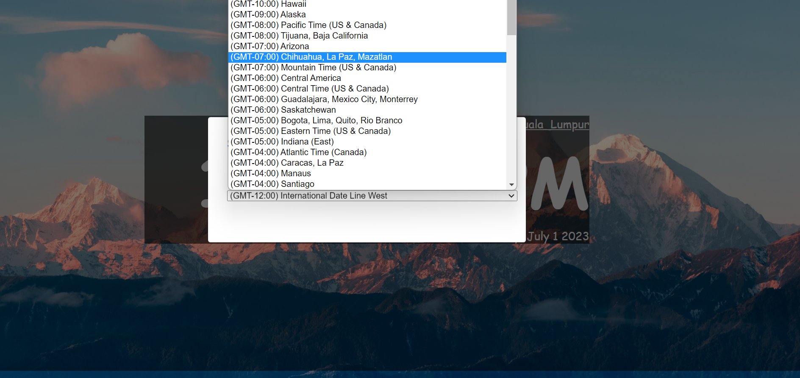

# Timezone

## Description
This project displays the current time and allows the user to change the timezone using a dropdown modal.

## Project Webpage
Check out the live demonstration of this project at [behhanyu.github.io/Timezone](https://behhanyu.github.io/Timezone/).

## Screenshots

## Technologies Used
- [Day.js](https://day.js.org/) - A JavaScript library for manipulating dates and times.
- [MicroModal](https://micromodal.now.sh/) - A lightweight JavaScript library for creating accessible modal dialogs.

## Acknowledgements
- The code for the MicroModal library was obtained from this [gist](https://gist.github.com/ghosh/4f94cf497d7090359a5c9f81caf60699#file-micromodal-html).
- The code for the dropdown menu was sourced from this [Stack Overflow post](https://stackoverflow.com/questions/39263321/javascript-get-html-timezone-dropdown).
- The implementation of the Day.js functionality was inspired by this [blog post](https://blog.openreplay.com/working-with-dates-and-times-with-day-js/).

